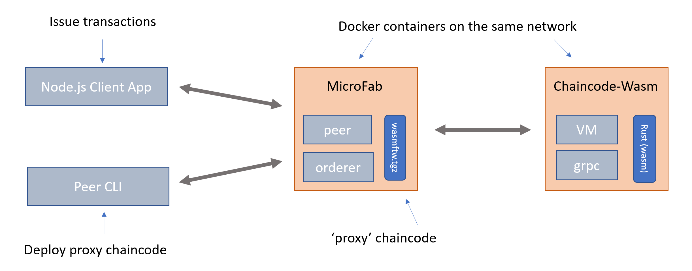

Here are the steps to run the `basic_contract_rs` using.
- Rust Smart Contract hosted within a Wasm engine
- Hyperledger Fabric v2

This guide will start up a 1 Organization, 1 Peer Fabric Network and start the contract. This is done using [MicroFab](https://github.com/ibm-blockchain/microfab) - a single containerized fabric network that is perfect for fast prototyping and developement. It's uses the Fabric binaries directly so it is really Fabric.

This is what we're going to be starting up and running,



- MicroFab will provide the Fabric v2 runtime, into which we are going to deploy a 'proxy' chaincode. We'll use the 'peer' cli commands to do this. 
- This proxy chaincode contains the information (host/port etc) for the peer to locate the docker image that the chaincode is running in.
- The chaincode here consists of a Wasm VM, into we'll load a Wasm binary.
- The Wasm binary will have been built from the Rust `basic_contract_rs`

## Getting setup

- Install the preqres for Rust and Wasm Development
  - Stable Rust is sufficient, nightly is not required. Instructions at the [rust-lang.org](https://www.rust-lang.org/tools/install)
  - To build a Wasm binary you will need to have the wasm target. Note that wasm-pack is not required here as there is no JavaScript host.
    - `rustup target add wasm32-unknown-unknown` 
- VSCode is our preferred editor, with the Rust Extension and the Rust Analyser
- Create a working directory to hold the github repos we'll clone. (examples assume that this is ~/github.com). 


### Hyperledger Fabric Command Line Tools

We need Fabric Version 2 cli binaries, you may already have these so can skip this.  

If not, to get the `peer` commands (rather than the docker images or samples directory).

```bash
curl -sSL https://raw.githubusercontent.com/hyperledger/fabric/master/scripts/bootstrap.sh | bash -s -- 2.2.0 1.4.4 0.4.18 -s -d
```

Ensure that the commands and configuration are setup correctly.

```
export PATH=$PATH:~/github.com/bin
export FABRIC_CFG_PATH=~/github.com/config
```

### External builders

Fabric knows about the following languages implicitly. Java, Node, Go. However the peer is not really supposed to be the orchestrator of creating docker images. So this is where the external builder comes in. Microfab is already configured to handle these. 

You still need to install a chaincode, but this is really configuration file that says where the actual chaincode is running. This is then added to a tgz archive file and installed as a regular chaincode. 

This is a prebuilt copy of this available, but if later you want to do this yourself grab a copy of https://github.com/hyperledgendary/fabric-builders/blob/master/tools/pkgcc.sh which will do this for you.

```bash
curl -s https://raw.githubusercontent.com/hyperledgendary/fabric-builders/master/tools/pkgcc.sh > ./pkgcc.sh
```

## Creation 

Now we're going to create the various assets etc that we need

### Smart Contract

- In your working directory, clone this repo
  - `git clone https://github.com/hyperledgendary/fabric-contract-api-rust.git`

- Ensure it can be built correctly, cd into the `fabric-contract-api-rust`
  - Using make: `make -f justfile wasm`
  - Using [just](https://github.com/casey/just): `just wasm`   
  - Using cargo: `cargo build --target wasm32-unknown-unknown`

This will have built a Wasm binary to `fabric-contract-api-rust/target/wasm32-unknown-unknown/debug/basic_contract_rs.wasm`

As we've cloned the whole repo, we've also got the Rust Contract crates source as well. Normally you would just add the dependencies from `crates.io`

### External chaincode container

Finally we need to have the Docker image that will host the Wasm VM; there's a prebuilt version of this on docker hub, but if you wish to build it yourself or to change from the default settings do the following.

Clone the `fabric-chaincode-wasm` reop

```bash
git clone git@github.com:hyperledgendary/fabric-chaincode-wasm.git
```

```bash
docker build -t hyperledgendary/fabric-chaincode-wasm .
```

Copy the `chaincode.env.sample` to `chaincode.env`. This will need to be editted shortly, so it's good to keep a copy of the original

### Start Microfab

First setup an environment variable:

```bash
export MICROFAB_CONFIG='{
    "endorsing_organizations":[
        {
            "name": "Ampretia"
        }
    ],
    "channels":[
        {
            "name": "minifignet",
            "endorsing_organizations":[
                "Ampretia"
            ]
        }
    ],
    "capability_level":"V2_0"
}'
```

Both Microfab and the Wasm chaincode will be run in separate docker containers. It's easier therefore to create a docker network to link these two.

```bash
docker network create wasm_network
```

Then issue this docker command to run MicroFab

```bash
docker run --name microfab --rm -d -p 8080:8080 -e MICROFAB_CONFIG="${MICROFAB_CONFIG}"  --network=wasm_microfab sstone1/microfab
```

### Get the MicroFab configuration

When applications (including the Peer commands ) run they need a local identity in a wallet and a gateway connection profile. In this case there's a helpful script that can pull out all the information needed. 

Run this in your working directory - some sub-directories will be created. 

```bash
npm install -g @hyperledgendary/weftility
curl -s http://console.127-0-0-1.nip.io:8080/ak/api/v1/components | weft microfab -w ./_wallets -p ./_gateways -m ./_msp -f
```

Then setup some environment variables for the peer commands; these are

```bash
export CORE_PEER_LOCALMSPID=AmpretiaMSP                                       
export CORE_PEER_ADDRESS=ampretiapeer-api.127-0-0-1.nip.io:8080
export CORE_PEER_MSPCONFIGPATH="${WORKING_DIR}/_msp/Ampretia/ampretiaadmin/msp"
```

## Contract Deploy

Tip: the `wasmftw.tgz` and `chaincode.env` files are in the `fabric-contract-api-rust\tests\assets` directory if you want to copy them directly.

### Package Proxy Chaincode

If you want to build the `wasmftw.tgz` yourself then do this otherwise, skip to the next step.

Create a `connection.json` file with details of how Fabric will connect to the external service chaincode

```
{
  "address": "wasmcc.example.com:9999",
  "dial_timeout": "10s",
  "tls_required": false
}
```

Package the `connection.json` file using the [pkgcc.sh](https://github.com/hyperledgendary/fabric-builders/blob/master/tools/pkgcc.sh) script

Again if you have the same directory structure, this command

```bash
../pkgcc.sh -l wasmftw -t external connection.json
```

A `wasmftw.tgz` file will be created. This is the chaincode package that will be installed on the peer - as the proxy for the real chaincode.  Feel free to unpack and investigate it's contents.  Note that this is the equiavlent of doing a `peer lifecycle chaincode package`

### Install the Proxy Chaincode

Install this proxy chaincode package.

```
peer lifecycle chaincode install wasmftw.tgz
```

It's important to keep the output from this command as it will be needed in the next step

### Run Wasm chaincode

Create a `chaincode.env` file, making sure the CHAINCODE_ID matches the chaincode code package identifier from the install command. (the one in the tests/assets directory should be sufficient if you've also copied the wasmftw.tgz file.  Just double check the package id matches)

```
CHAINCODE_SERVER_ADDRESS=wasmcc.example.com:9999
CHAINCODE_ID=wasmftw:a5ceee0db53cdb4b50975c2379cc346075697873341af71a7440b5d4d7f1ca0c
CHAINCODE_WASM_FILE=/local/basic_contract_rs.wasm
```

It's also worth copying the wasm binary file created previously, for example if you're following the same directory structure run this command from your working directory

```bash
mkdir -p contracts
cp ./fabric-contract-api-rust/target/wasm32-unknown-unknown/debug/basic_contract_rs.wasm ./contracts
```

Run the chaincode: note that this docker command runs it in foreground so you can watch what happens.  Worth opening another terminal at this point to run this in docker command in.

If you've built you wown fabric-chaincode-wasm container adjust the image name.

```
docker run -it --rm -v ${PWD}/contracts:/local:ro --name wasmcc.example.com --hostname wasmcc.example.com --env-file chaincode.env --network=wasm_microfab calanais/fabric-chaincode-wasm:tp1
```

### Approve and commit the Wasm chaincode

Approve the chaincode, making sure the `package-id` matches the chaincode code package identifier from the install command

```
peer lifecycle chaincode approveformyorg -o orderer-api.127-0-0-1.nip.io:8080 --channelID minifignet --name wasmftw --version 1 --sequence 1 --waitForEvent --package-id wasmftw:eeae07c6e9455f329e28f9a0eed977ae3549be68e68247018f71dc5a5f511c0d
```

Commit the chaincode

```
peer lifecycle chaincode commit -o orderer-api.127-0-0-1.nip.io:8080 --channelID minifignet --name wasmftw --version 1 --sequence 1
```

## Run a transaction!

Create an asset....

```bash
peer chaincode invoke -o orderer-api.127-0-0-1.nip.io:8080 --channelID minifignet -n wasmftw -c '{"function":"AssetContract:create_asset","Args":["007","Bond"]}'
```

Get back the value

```bash
peer chaincode query  -o orderer-api.127-0-0-1.nip.io:8080 --channelID minifignet -n wasmftw -c '{"function":"AssetContract:read_asset_value","Args":["007"]}'
```

## Using a node.js client application

Running the peer commands is ok, but really one of the SDKs will be used to run client applications.

As an example client application we can use [runhfsc](https://github.com/hyperledgendary/runhfsc). This uses the latest Fabric Node SDKs, and runs in node 12.

```bash
npm install -g @hyperledgendary/runhfsc
```

From your working directory, run this command to point the application at the client wallets and connection profile
```bash
runhfsc --gateway ./_gateways/ampretiagateway.json --wallet ./_wallets/Ampretia --user ampretiaadmin --channel minifignet
```

This will connect and you can see the prompt with the id and channel, type in `contract wasmftw`

```bash
[default] ampretiaadmin@minifignet:<contractid> - $ contract wasmftw
Contract set to wasmftw
[default] ampretiaadmin@minifignet:wasmftw 
```

We can now repeat the final peer command but driving the Node.js SDK

```bash
evaluate 'AssetContract:read_asset_value' '["007"]'
Submitted AssetContract:read_asset_value  007
[ '007' ]
> 
Bond
```


